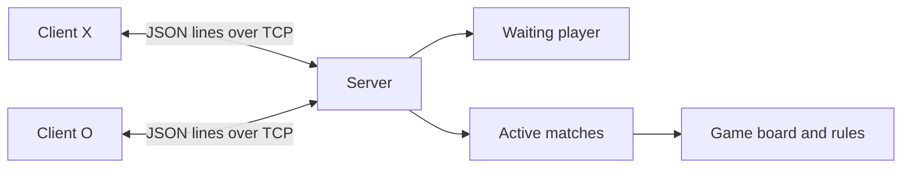

# Architecture

## Overview

The task needs one server binary and multiple client binaries. Game rules are separate from TCP handling so a move can be tested without opening a connection. The server is the source of truth for matches and boards.

The expected task range is up to 100 client processes. The [load test](performance.md#1000-client-tcp-load-test) also checks 1,000 TCP connections with lightweight clients.



## Packages

| Package | Owns |
| --- | --- |
| [`game`](../game/game.go) | Board, turn, winner, draw, and move validation. |
| [`protocol`](../protocol/message.go) | Request and response fields on the wire. |
| [`server`](../server/server.go) | Connections, waiting player, matches, and outgoing messages. |
| [`cmd/server`](../cmd/server/main.go) | Listener setup and signal handling. |
| [`cmd/client`](../cmd/client/main.go) | Terminal input and board display. |
| [`scripts/test.go`](../scripts/test.go) | Runs the real binaries and checks complete games. |
| [`scripts/load.go`](../scripts/load.go) | Runs many lightweight TCP clients against a separate server process. |

The server imports `game` and `protocol`. The client imports `protocol`. `game` does not depend on network or terminal code. No database is used; a match ends when its players finish or disconnect.

## Match Flow

1. `Serve` accepts a TCP connection and starts a handler.
2. The first client is placed in the waiting slot and gets `waiting`.
3. The next client is paired with it. First client gets X, second gets O. Both get the empty board.
4. A client sends `move` with a board index from 0 to 8. The server checks the symbol, turn, square, and game status.
5. After a valid move, both players get the full board. Invalid moves return `error` to the sender only.
6. After a win or draw, both players get the final board and their connections close. They reconnect to play again.
7. If a client leaves before the game finishes, the opponent gets `opponent_left` and goes back to matchmaking.

Pairing order is the order in which handlers acquire the server mutex. Two clients that connect at almost the same time may be paired in a different order than their wall-clock arrival.

## State and Concurrency

| State | Owner |
| --- | --- |
| Waiting player and connected player set | `server.Server` |
| Match links and assigned symbols | Server player records |
| Board, turn, winner, finished flag | `game.Game` inside a match |
| Board shown in the terminal | Client copy of the last `state` message |

`Server.mu` protects the waiting slot, player set, match links, and game changes. `game.Game` has no internal mutex. A caller using it concurrently must provide its own lock. Functions ending in `Locked` are called with `Server.mu` already held.

Each player has one reader handler and one writer goroutine. The writer is the only goroutine writing to that socket. Its outgoing channel holds up to 16 messages. The server queues messages while holding the mutex, but the network write happens after the lock is released. A full queue or a write taking more than five seconds closes the connection.

The server copies the board before placing a `state` message in the writer queue. A later move cannot change a state that is waiting to be sent.

During shutdown, `Serve` sets `stopping` and copies the registered connections under the mutex. It closes those sockets after unlocking. A handler that reaches registration after `stopping` is set closes its new connection instead of adding it to the map. The server then waits for all handlers to exit.

## Protocol

TCP does not preserve message boundaries. Each message is one JSON object followed by a newline.

```json
{"type":"move","position":4}
```

Position 4 is the center square, shown as 5 in the terminal.

| Type | Sent by | Fields / use |
| --- | --- | --- |
| `move` | Client | `position`, 0 to 8. |
| `waiting` | Server | Waiting for another player. |
| `state` | Server | Board, recipient's symbol, turn, winner, finished status. |
| `error` | Server | Rejected message or move, with detail. |
| `opponent_left` | Server | Opponent disconnected before the game ended. |

`Position` is a pointer so position 0 is different from an omitted position. `Board` is also a pointer: it is present in `state` messages and omitted from messages without game state. The board is a snapshot, not a pointer to the live game board.

## Failure Handling

| Case | Behavior |
| --- | --- |
| Invalid turn, symbol, position, or occupied square | Send `error`; board stays the same. |
| Bad JSON or missing move position | Send `error`; keep the connection open. |
| Input line over 4 KiB | Stop reading and close the connection. |
| Player leaves mid-game | Requeue the opponent and start a new match when another client arrives. |
| Waiting player disconnects before its reader notices | A new player can briefly pair with it. The disconnect then requeues the surviving player. |
| Slow client | Close it when the output queue is full or a write fails/times out. |
| Listener error | Close listener and registered connections, wait for handlers, return the error. |
| Server restart | In-memory matches are lost; clients need to reconnect. |

There is no heartbeat, idle timeout, rate limit, connection cap, health endpoint, or persistent game history. The TCP connection is plaintext. Move validation prevents a client from changing the board directly, but there is no identity or transport security for a public deployment.
